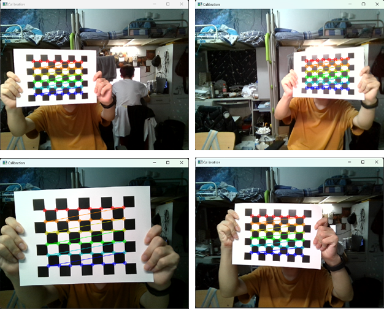
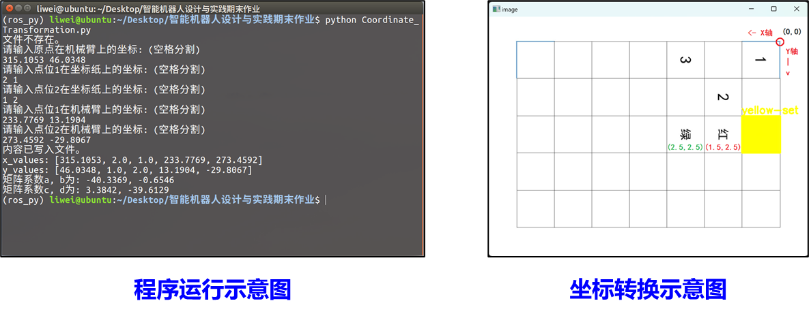
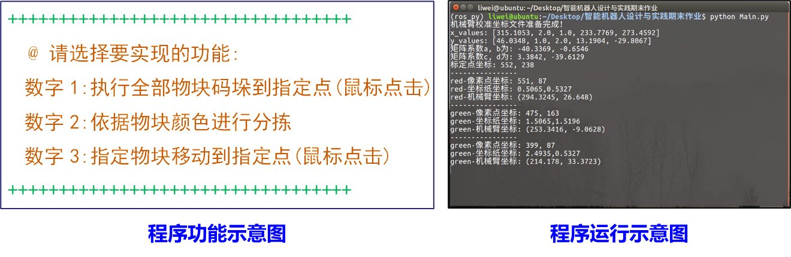

### 基于ROS的视觉机械臂系统综合设计与实现

``` powershell
智能机器人设计与实践
|-- Calibration_Coordinates.txt   # 储存机械臂校准坐标的文件
|-- Calibration_Results.npz       # 摄像头标定结果参数的文件
|-- Camera_Calibration.py         # 摄像头标定的代码文件
|-- Coordinate_Transformation.py  # 机械臂的坐标校准与给定坐标准换的代码文件
|-- Goal.cpp                      # dobot机械臂执行功能指令的代码文件
|-- Main.py                       # 物块坐标捕获并转换为机械臂坐标并实现功能的代码文件
|-- Target_Coordinates            # 内含物块的机械臂坐标与功能标定
|-- run.sh                        # 起始运行文件
|-- ReadMe.md                     # 阅读文档
`-- Appendix
    |-- test.jpg
    |-- Calibration_board.pdf
    `-- Coordinate_paper.pdf

1 directory, 12 files
```
### 说明
- 基于Systemback制作的配置好此项目的映像链接 - [ISO映像文件(默认密码：0)](https://www.123pan.com/s/WqsiVv-sPVGh.html)
- 于releases中下载dobot_ws.zip与ROS_CV_CODE.zip复制到Ubuntu中并配置好
- 开源协议 - The [Apache License 2.0](LICENSE)

### 一、摄像头标定方案
- Camera_Calibration.py：在此文件中我们构建了一组功能和算法，可以通过对摄像头拍摄的图像进行处理和分析，从而得到摄像头的内参和畸变参数，进而实现摄像头的校准


### 二、机械臂的坐标校准与给定坐标转换
- Coordinate_Transformation.py：在摄像头采集图像之后并读取物体中心点坐标，在此程序里进行坐标转换，首先进行坐标映射，转换到坐标纸平面的坐标，最后运用矩阵方程将坐标纸平面坐标换算成机械臂视角的坐标
- Main.py：获取掩膜，对物块进行分析获取物块的位置信息


### 三、使用ROS框架进行机械臂控制
- 基于OpenCV进行物块坐标捕获并转换为机械臂坐标
- 通过ROS框架，编写Python脚本配合C++语言的Dobot-API
- 实现**全部物块执行码垛到指定点**、**依据物块颜色进行分拣**、**指定物块移动到指定点的目标功能**


#### 1.执行全部物块码垛到指定点


#### 2.依据物块颜色进行分拣

#### 3.指定物块移动到指定点的目标功能


### 四、部署代码文件使用说明：

△注意：

- 以下步骤均在***Ubuntu16.04+ROS Kinetic***环境下部署，请配置好***dobot***环境，开启***roscore***以及***dobot***初始化

- 默认运行使用存在的标定文件***Calibration_Results.npz***，如需要进行重新标定则运行***Camera_Calibration.py***

  

#### 1.自动化脚本文件运行

提示：

- 将 ***ROS_CV_CODE*** 文件夹复制到虚拟机桌面目录下，即：***/home/用户名/Desktop/ROS_CV_CODE***
- 如遇到 ***/r*** 问题请运行命令 **dos2unix *run.sh*** 后 ***dos2unix run.sh*** 即可

1. 在 ***ROS_CV_CODE*** 目录下运行终端输入 ***./run.sh*** 命令即可

   

#### 2.手动配置文件运行

提示：***username*** 均需要替换成当前使用的用户名

1. 将 ***ROS_CV_CODE*** 文件夹复制到虚拟机桌面目录下，即：***/home/username/Desktop/ROS_CV_CODE***
2. 修改 ***Goal.cpp*** 文件内第***159***行将 ***username*** 修改为你的当前用户名
3. 将文件夹内的 ***Goal.cpp*** 文件放置到 ***/home/username/dobot_ws/src/dobot/src/*** 并编写 ***CMakeLists*.txt** 文件（添加文件配置）
4. 在 ***dobot_ws ***目录下进行 ***catkin_make***
5. 在 ***shell*** 终端运行 ***python Main.py*** 命令开始执行程序

